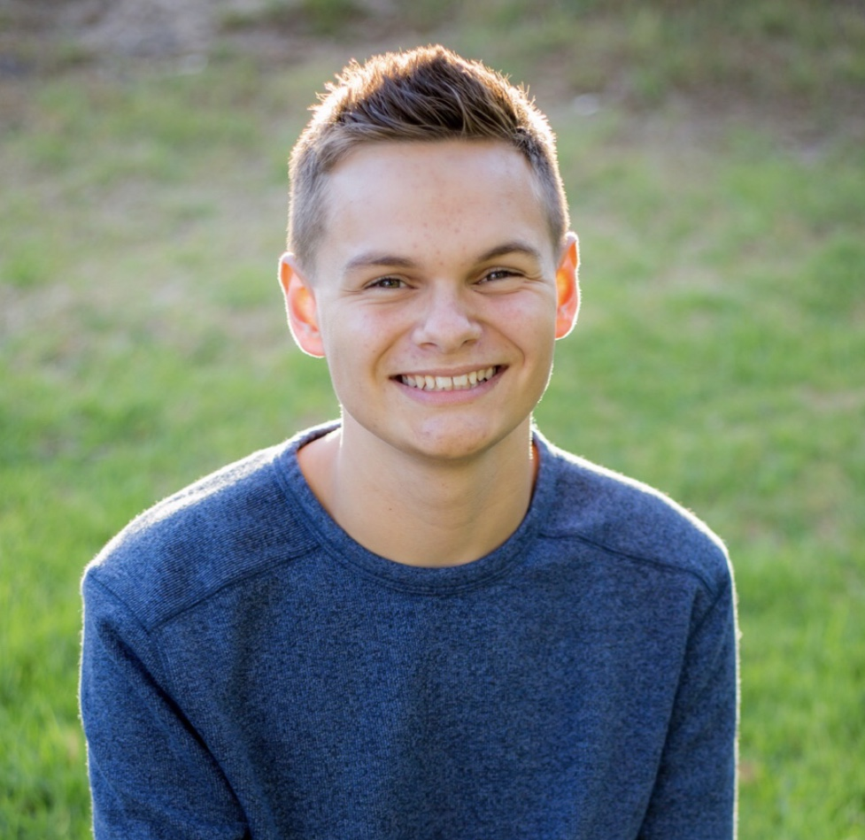

Online Office Hours for CS16 F22 are held here: <TBD>

# Section and Office Hours

Sections will start in person on 09/29
Office hours for the week of 09/26- 09/30 will be online via Zoom.
Here is the link: <https://bit.ly/cs16-f22-zoom-office-hours>

<iframe src="https://docs.google.com/spreadsheets/d/e/2PACX-1vRrjaOYKvrRqXLKtOe-P0YMuVp0MdAX01bgvnXdmUMZ9xZ7RDIiFM4kFjuxJblrTFha25zuqWDotREE/pubhtml?widget=true&amp;headers=false"></iframe>

# Course Staff

## Course instructor: Diba Mirza

* Email: Please use Piazza rather than email for course related communication.  You can send private messages on Piazza to either the entire course staff or directly to me. If you must email me using my email address (diba@ucsb.edu), please put `CS16` in the subject line, and know that there may be a delay in the response.

## Course TAs
* {{site.ta_names}}
* Contact via Piazza.

## Learning Assistants (LAs)
In addition to the instructor and TA, there will be some undergraduate Learning Assistants (LAs) in the course who are available to assist you during your scheduled lab sections (also called closed labs) and by holding additional help hours outside of sections (also called open-labs). The closed-labs are only available to students registered for that lab section on GOLD. The open-labs are available to all students registered in the course (similar to office hours).

## Learning Assistants in training (LAs in training)

There may also be a few LAs in training, students in course numbered CMPSC 100.  These students will be shadowing the instructor, TAs, and LAs during the first five weeks of the course to learn about teaching CS.  During the first five weeks of the course, they are not permitted to help (it is a union violation), only observe.  Please make them welcome, and respect their boundaries.  Starting in week 6, they will start getting paid, and will start helping with the course.

# CS 16 Staff Profiles

## Diba Mirza, Instructor

Diba Mirza is a Associate Teaching Professor in the CS department at UC Santa
Barbara.  Prof. Mirza joined the CS department in 2017, after
previously teaching at UC San Diego, where he earned his Ph.D.  His current
research is in the area of CS Education, and focuses
on broadening participation in research through early research experiences for undergraduates.

## Alex Mei, TA

 
Hello There! I am Alex Mei, a computer science B.S./M.S. student at University of California, Santa Barbara advised by Professors William Wang and Shiyu Chang under the Natural Language Processing Group. My research interests lie in responsible machine learning, with a current focus on AI safety and transparency. In the past, I have interned at Procore, Benchling, and Two Sigma. In my free time, I am enjoy cooking (alexmeicooking.com) and watching reality competitions (Survivor, The Amazing Race, Masterchef, Hell's Kitchen). Feel free to reach out if you'd like to discuss research, internships, C++ development, or anything else; always happy to help! 

<pre>
Office Hours: T 9:30 - 10:30 AM (Henley 2002 or online)
</pre>

## Gautam Mundewadi, TA

Hey all! My name is Gautam and I'm a second year CS Masters student. I was previously an undergrad here at UCSB and was part of the BS/MS program in computer science. I'm currently graduate researcher at the RACElab and my area of research is smartfarm technologies. I've previously interned at Microsoft and Meta and will be joining Meta full time as software engineer in December. As for clubs on campus, I was previously president of Coders SB (check them out!) and Dhadkan. In my free time I love to play video games, paint, kayak from time to time, and wake up early for Formula 1 races. Feel free to reach out if you'd like to know more about my experiences or have any other general questions about UCSB. I'm super excited to be a part of the CS16 staff and I look forward to working with everyone!

## Kaiwen Li, TA

Hi everyone, my name is Kaiwen Li. I am a first year MS student under BS/MS program in UCSB. I was working on Amazon Alexa team this summer and developed a smart notification delivery system to deliver notifications at an appropriate time. I enjoy riding bikes and I have a white kawasaki. I will ride my bike to school everyday unless it is raining. Don't hesitate to ask me anything about homework, internship, or anything else.
<pre>
Office Hours: R 10AM - 11AM (remote)
</pre>

## Vinothini Gunasekaran, TA

My name is Kevin, but call me Kev. I am a Master of Technology Management student who recently studied my undergraduate in CS at UCSB. I also recently worked at Appfolio as a Software Quality Assurance Engineer before returning to UCSB. 

I love to chat. Please come to me with any questions about homework, labs, or career planning. I would be happy to help you along.

My hobbies include dancing, singing, beach volleyball, and spending with with the people I love. 

## Gretchen Lam, LA

 Hi everyone! My name is Gretchen, and I'm a 2nd year CS major from Orange County, CA. I'm very excited to be one of your ULAs for CS16, especially since I really enjoyed this course last year. I'm currently involved in TASA here at UCSB, and in my free time, I love playing games, watching anime, movies, and TV shows, and exploring the city! I would love nothing more than to further not only your learning, but my own as well, so please feel free to ask questions or just chat!

## Zackary Glazewski, LA

Hello everyone! My name is Zack Glazewski and I'm a 3rd year CS Major. I feel very excited to help you all not only learn, but enjoy the process along the way. Some more information about me: I love cats (I have a cat named Link who is bascially my child), playing piano, and developing my own games. I'm always happy to help, so please don't hesitate if you have any questions. I look forward to meeting you all!

